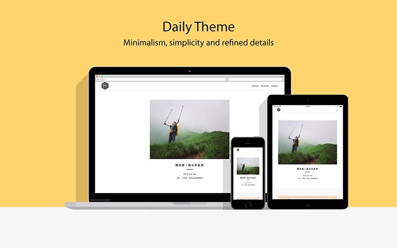

# hexo-theme-Daily


A simple theme for Hexo(version 4.x). Demo: :point_right: [Demo Site](https://hinpc.github.io/Daily/) or [国内访问](http://gallenhu.gitee.io/daily/) :point_left:

## ScreenShot


## Usage
0. (Optional) Specify Hexo version in the `root` directory

❗️ This theme maximum supported hexo version 4

```sh
$ hexo version # check version
$ npm i hexo@4.2
```

1. In the `root` directory:
```sh
$ git clone https://github.com/GallenHu/hexo-theme-Daily.git themes/Daily
$ npm install --save hexo-renderer-sass
```

2. Change the `theme` property in the `config.yml` file.
```yml
# theme: landscape
theme: Daily
```

3. Run:
```sh
$ hexo server
```

## Documentation
[文档](/docs/Home.md)

## Browser Support


## Inspired by
WordPress theme [Daily](http://www.robertbrodziak.com/en/free-wordpress-themes/daily-theme/)
Any Question,Please Contact: gallenhu#foxmail.com
